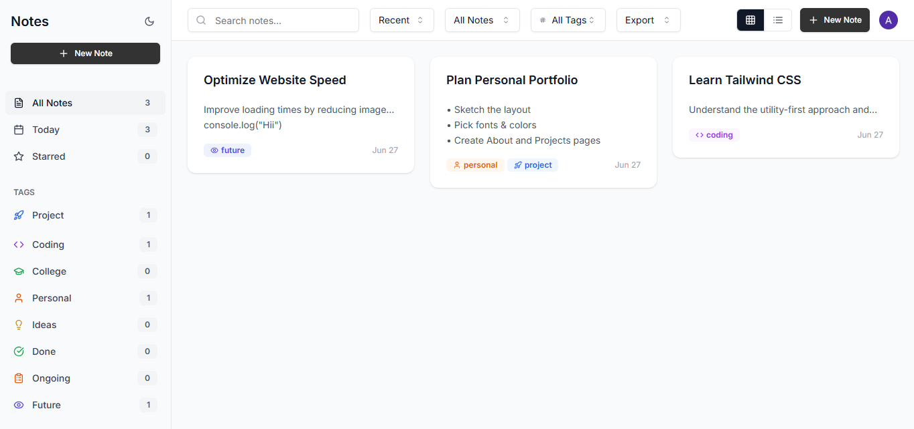

# 📝 eNote - Your Smart Note-Taking Companion

## 🌟 Project Overview
eNote is a modern, feature-rich note-taking application built for the digital age. Whether you're a student, professional, or creative mind, eNote provides the perfect platform to capture, organize, and enhance your thoughts.

## ✨ Key Features
- 📱 **Modern UI/UX**: Clean, intuitive interface with both light and dark mode support
- 📝 **Rich Text Editor**: Advanced editing capabilities with slash commands
- 💻 **Code Snippets**: Built-in code editor with syntax highlighting
- 📊 **Text Analysis**: Real-time statistics and insights about your notes
- 📁 **Folder Organization**: Hierarchical folder structure for better organization
- 🔍 **Smart Search**: Quick and efficient note search functionality
- 💾 **Auto-Save**: Never lose your work with automatic saving
- ⌨️ **Keyboard Shortcuts**: Boost your productivity with quick commands
- 🎨 **Customization**: Personalize your experience with themes and settings

## 🛠️ Technology Stack
- **Frontend**: React + TypeScript
- **Styling**: Tailwind CSS + Shadcn UI
- **Editor**: TipTap
- **State Management**: Custom stores
- **Backend Integration**: Supabase
- **Build Tool**: Vite

## 🚀 Getting Started

1. Clone the repository:
```bash
git clone https://github.com/amitdevv/eNote.git
```

2. Install dependencies:
```bash
npm install
```

3. Start the development server:
```bash
npm run dev
```

## 📱 Screenshots



## 🎯 Project Goals
- Create an intuitive note-taking experience
- Provide powerful organization tools
- Enable seamless code snippet management
- Ensure responsive and fast performance
- Support collaborative features

## 💡 Future Enhancements
- Real-time collaboration
- Mobile application
- Export to multiple formats
- AI-powered note suggestions
- Advanced search filters


## 📄 License
MIT License - feel free to use and modify! 