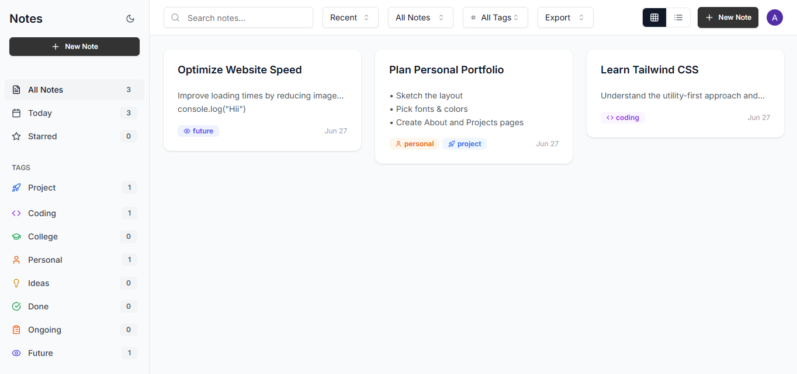

# eNote

A fast, opinionated note-taking app with a personal AI layer over your own
content. Write freely, find things by meaning, ask your notes questions, and
get answers grounded in what you actually wrote — without handing your data
to a third party.



## What's in it

### Core writing
- Rich-text editor (TipTap) with slash commands, headings, lists, code blocks,
  quotes, tables, links, images, and inline formatting
- Crash-safe drafts — if the tab dies mid-sentence, your changes come back
- Labels with per-label colors, auto-created inline Notion-style
- Highlights, pins, archive, bulk actions
- Tasks with priority, due dates, subtasks — lightweight todo layer
- Pinterest-style masonry grid for the notes list
- Density (compact / default / comfortable), font pairing (UI font + editor
  font), and other preferences that sync across devices

### AI layer
Bring your own free Google Gemini key and eNote becomes a memory layer over
your notes. Everything runs on the free tier; costs stay at $0.

- **Semantic search** — `⌘K` → "Ask" mode. Find notes by meaning, not
  keywords. `"auth bug"` finds the note that actually says "session token
  expired."
- **Related notes** — a sidebar card on every note surfaces the 3 closest
  neighbours by cosine similarity. Silent when there are none.
- **Ask your notes** — a dedicated `/ask` page with a ChatGPT-style UI.
  Stream an answer grounded in the top-5 most relevant notes, with inline
  `[1] [2]` citation chips that jump to the source note.
- **Full chat history** — every conversation is saved server-side, listed
  grouped by day in a left panel, auto-titled by Gemini after the first
  answer. Resume any past chat from any device.
- **Silent auto-indexing** — edit a note, wait 2s, it re-embeds in the
  background. A small pulsing dot in the note header shows when work is in
  flight.
- **Usage counters** in Settings → AI show today's embedding + chat calls.
  Your key, your quota, your privacy.

## How the AI layer works

```
  Client (React + Vite)
     │
     ▼
  Supabase Edge Functions (Deno)
     │ ├── gemini-key   — validate, AES-256-GCM encrypt, store
     │ ├── gemini-embed — text → 768-dim vector (RETRIEVAL_QUERY/DOCUMENT)
     │ ├── gemini-ask   — embed q → RAG top-5 → stream answer → persist turn
     │ └── gemini-title — 3-5 word auto-title for new chats
     ▼
  Postgres (via Supabase) with pgvector
     • notes.embedding vector(768) + HNSW cosine index
     • search_notes_by_embedding RPC — RLS-scoped top-K
     • related_notes_by_id RPC — neighbors of a given note
     • ai_conversations + ai_turns — chat history, RLS-per-user
     • ai_usage — per-day counters for embed / ask calls
```

Design notes worth calling out:

- **BYOK (bring your own key).** The user's Gemini key is AES-256-GCM
  encrypted at the Edge Function layer and stored on `user_settings`. The
  key never goes back to the client; all AI calls proxy through Edge
  Functions that decrypt server-side. Users pay nothing (Gemini's free tier
  is generous). The hosting bill scales to users the business isn't paying
  for.
- **RLS all the way down.** Every AI table (`ai_conversations`, `ai_turns`,
  `ai_usage`) has row-level security on `auth.uid()`. Search RPCs use
  `SECURITY INVOKER` so they respect RLS — no service-role bypass in the
  retrieval path. The one service-role write (embedding a specific note)
  pairs an explicit ownership check with a `.eq('user_id', …)` in the
  `UPDATE` itself, as defense-in-depth.
- **Streaming with citations.** `gemini-ask` emits SSE events
  (`conversation` → `sources` → `token…` → `done`), so the UI renders the
  source cards before the first token arrives. The client parser is a small
  hand-written SSE reader — no extra dependency.
- **Task-type hints.** Gemini's asymmetric retrieval modes
  (`RETRIEVAL_QUERY` for questions, `RETRIEVAL_DOCUMENT` for the corpus)
  produce visibly better top-1 separation than the generic embedding mode.

## Tech

- **React 19 + TypeScript + Vite**
- **Tailwind CSS** with a small custom token layer (density, brand accent,
  text scale)
- **Supabase** — Postgres, Auth (Google OAuth), Edge Functions (Deno), and
  the `pgvector` extension
- **TipTap + ProseMirror** for the editor
- **React Query** for server state, **Zustand** for UI state
- **cmdk** for the command palette, **Radix primitives** for dialogs,
  tooltips, dropdowns, tabs
- **Google Gemini** — `gemini-embedding-001` for vectors,
  `gemini-2.5-flash` for chat (both on the free tier, BYOK)

## Getting started

```bash
git clone https://github.com/amitdevv/eNote.git
cd eNote
npm install
```

Create a `.env` at the project root:

```
VITE_SUPABASE_URL=https://your-project.supabase.co
VITE_SUPABASE_ANON_KEY=your_anon_key
```

Run the dev server:

```bash
npm run dev
```

App runs at `http://localhost:5173`.

### Enabling the AI layer (optional)

The core app works without AI. To light up semantic search, related notes,
and chat:

1. Link your Supabase project:
   ```bash
   supabase link --project-ref <your-project-ref>
   ```
2. Apply the migrations:
   ```bash
   supabase db push
   ```
3. Set a server-side encryption key (32 random bytes, base64):
   ```bash
   openssl rand -base64 32 | xargs -I{} supabase secrets set ENCRYPTION_KEY={}
   ```
4. Deploy the Edge Functions:
   ```bash
   supabase functions deploy gemini-key gemini-embed gemini-ask gemini-title
   ```
5. Start the app, sign in, and go to **Settings → AI**. Paste a free Gemini
   key from [aistudio.google.com/app/apikey](https://aistudio.google.com/app/apikey).
   The key is validated, encrypted, and stored. Your existing notes are
   backfilled in the background.

## Project layout

```
src/
  app/              — routing + providers + shell
  features/
    ai/             — BYOK, embedding queue, Ask chat, conversation history
    auth/           — Google OAuth via Supabase
    notes/          — editor, list, detail, labels, slash commands
    tasks/          — tasks feature
    labels/         — label palette + settings
    highlights/     — saved highlights
    account/        — profile + delete account
    settings/       — tabbed settings, device-syncing preferences
  shared/           — UI primitives, command menu, app shell, hooks

supabase/
  migrations/       — schema (notes, tasks, labels, highlights,
                      user_settings, AI layer)
  functions/
    _shared/        — auth, crypto (AES-GCM), cors, gemini client
    gemini-key/     — BYOK: validate + encrypt + store
    gemini-embed/   — text → 768-dim vector, optional note write-through
    gemini-ask/     — streaming RAG with persisted turns
    gemini-title/   — auto-title chats after the first answer
```

## Companion docs

- [`PLAN.md`](./PLAN.md) — architecture + execution checklist for the rebuild
- [`DESIGN.md`](./DESIGN.md) — the visual language (tokens, typography,
  component patterns)

## License

MIT.
